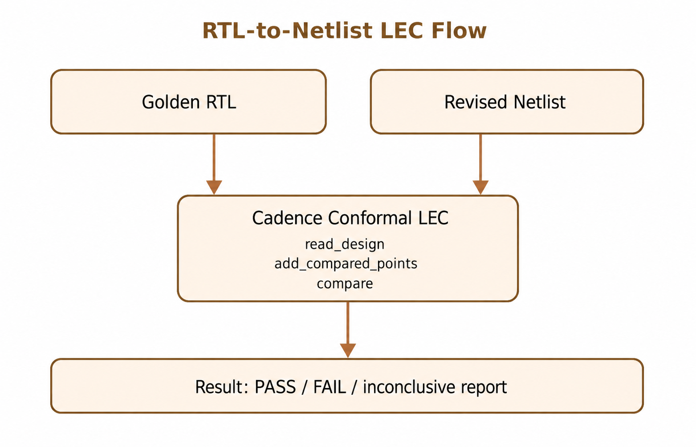

# RTL-to-Netlist LEC 使用說明

本文件搭配 [rtl_to_netlist_lec.tcl](./rtl_to_netlist_lec.tcl)，使用 **Cadence Conformal Equivalence Checker Tcl mode** 證明 Golden RTL 與 synthesis 後 Revised gate-level netlist 在功能模式下等價。



## 目的與邊界

此檢查用來發現 synthesis、technology mapping、clock gating、DFT insertion 或 netlist 交付過程造成的功能差異。它不驗證 timing、CDC、類比行為或實體 connectivity，也不能用模糊的 black-box/ignore 設定取代 library 與 constraint 的正確建模。

最可靠的起點通常是 synthesis 工具產生的 Conformal dofile 與 mapping/implementation guidance，因為其中會保存 optimization、retiming、clock-gating、scan 與命名資訊。本專案腳本是教學用的最小 flat flow。

## 前置需求

- Golden RTL 的完整 file list、include/define/parameter 與 top module。
- synthesis 輸出的完整 netlist；通常 top netlist 已包含所有 design modules，不要臆測拆分檔名。
- synthesis 實際使用、且 Conformal 能讀取的 standard-cell/macro model。
- functional-mode constraints，例如 `scan_enable=0`、`test_mode=0`。
- 已建立 `logs/`，且 Conformal license/執行環境可用。

範例目錄：

```text
project/
├── rtl/
│   ├── top.v
│   ├── alu.v
│   └── control.v
├── netlist/
│   └── top_netlist.v
├── libs/
│   └── slow.lib
├── logs/
└── rtl_to_netlist_lec.tcl
```

## 設定腳本

修改所有範例值：

```tcl
set TOP_MODULE top
set LOG_FILE ./logs/rtl_to_netlist_lec.log
set GOLDEN_FILES [list ./rtl/top.v ...]
set NETLIST_FILES [list ./netlist/top_netlist.v]
set LIBERTY_FILES [list ./libs/slow.lib]
```

### Library 選擇

腳本範例使用：

```tcl
read_library $LIBERTY_FILES -liberty -both
```

Liberty 必須含 Conformal 建模所需的 Boolean/sequential cell 資訊。有些 foundry/IP flow 要求 cell Verilog model、memory model 或額外 macro library；此時應依站點 reference flow 調整 `read_library`，不能把所有 undefined cell 一律設成 black box。若 black box 介面或兩側對應錯誤，表面 PASS 仍可能漏驗邏輯。

### RTL 與 synthesis 設定對齊

Golden side 應使用與 synthesis 相同的語言版本、include directories、macro defines、parameters 及 source order。也要加入 synthesis/DFT 所需的 functional constraint、clock gating、retiming、low-power 或 sequential mapping 設定。這些設定需放在進入 LEC mode 之前，具體 option 以工具 release 與 synthesis 產出的 dofile 為準。

## 執行

```bash
mkdir -p logs
lec -nogui -tclmode -dofile rtl_to_netlist_lec.tcl
```

相對路徑以啟動 `lec` 的 working directory 為基準。若安裝版本不接受命令列 `-tclmode`，可移除它；腳本本身第一行已執行 `tclmode`。

## 腳本流程

1. 檢查 RTL、netlist、library 與 log 目錄。
2. 用 `read_library ... -both` 載入 cell semantics。
3. 用 `read_design ... -golden/-revised -root` 載入兩側設計。
4. 檢查 design data 與 black boxes。
5. 進入 LEC mode、加入所有 compare points 並執行 `compare`。
6. 輸出 verification、compared points、unmapped points 與 batch exit code。

## PASS 接受條件

不能只看到 `compare` 結束或 shell 回傳 0 就視為 signoff。至少確認：

- `report_verification` 明確為 equivalent/PASS。
- 沒有 non-equivalent 或 aborted point。
- unmapped、unreachable、ignored point 數量及原因均符合預期。
- black boxes 和 macro models 完整且兩側對應正確。
- scan/test/clock/reset constraints 與功能模式一致。
- log 中沒有被忽略的 read、elaboration、library 或 width warning。

## 常見問題

### Undefined cell / black box

確認 netlist instance 的 cell name、library corner/model、pin/function 是否正確。LEC 著重邏輯功能，選用的 library 不一定是 STA corner 的概念，但必須與 netlist cell 定義相容。

### 大量 unmapped points

先查 top、hierarchy、bus naming、constant propagation、register merge、clock gating 與 synthesis guidance。不要直接 ignore；unmapped point 可能代表驗證 coverage 缺口。

### Reset、initial state 或 X mismatch

核對 async/sync reset polarity、power-up assumption、RTL initial construct、2-state/4-state/X conversion 及 synthesis 處理。所有額外 assumption 都應記錄理由。

### Scan/DFT mismatch

通常要把 scan enable、test mode 固定在功能值，並處理 scan-only output；constraint 必須精確套用到正確 side/pin。若驗證目標包含 test mode，則不能把它排除。

### Aborted points 或執行時間過長

先排除 setup/library/mapping 問題。大型 RTL-to-gate compare 應改用 synthesis 產生的 hierarchical flow，再視需要調整 datapath analysis、partition 與 compare effort；aborted 永遠不是 PASS。

## Signoff 可重現性

保存 Conformal 與 synthesis 版本、執行命令、完整 file/library list、constraints、generated guidance、log、verification/exception reports，以及每個 waiver 的核准理由。設計或 constraint 有任何變更都應重新執行，而不是沿用舊結果。
