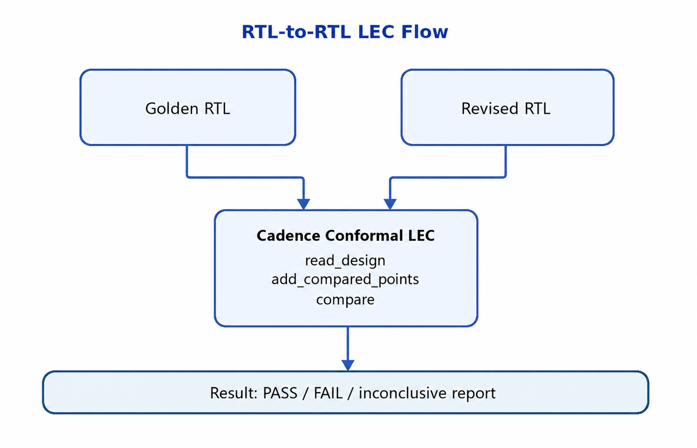

# RTL-to-RTL LEC 使用說明

本文件搭配 [rtl_to_rtl_lec.tcl](./rtl_to_rtl_lec.tcl)，使用 **Cadence Conformal Equivalence Checker Tcl mode** 比較 Golden RTL 與 Revised RTL。它適合重構、FSM/資料路徑改寫、clock-gating 前後或小範圍 ECO 的功能等價檢查。



## 等價範圍

LEC 驗證的是指定輸入假設與狀態模型下的邏輯等價，不等同於 simulation regression、CDC、lint 或 timing signoff。下列變更尤其需要額外設定或不同的 formal 方法：

- top-level port 名稱、寬度或 protocol 改變
- pipeline latency、state encoding 或 initialization 語意改變
- clock/reset 架構、X semantics、memory model 改變
- intentionally non-equivalent 的功能修改

若 latency 或 protocol 本來就不同，單純 combinational/sequential LEC 未必是正確驗證模型。

## 前置需求

- 可執行 Cadence Conformal，且 license/環境已設定。
- Golden 與 Revised 兩側所有 RTL、include file、macro define 與 IP model 齊全。
- 知道兩側共同的 top module 與 functional-mode 假設。
- 建立 `logs/` 目錄；範例腳本不會自動建立它。

範例目錄：

```text
project/
├── rtl/
│   ├── golden/
│   │   ├── top.v
│   │   ├── alu.v
│   │   └── control.v
│   └── revised/
│       ├── top.v
│       ├── alu.v
│       └── control.v
├── logs/
└── rtl_to_rtl_lec.tcl
```

## 設定腳本

先修改腳本開頭的變數：

```tcl
set TOP_MODULE top
set LOG_FILE ./logs/rtl_to_rtl_lec.log
set GOLDEN_FILES [list ./rtl/golden/top.v ...]
set REVISED_FILES [list ./rtl/revised/top.v ...]
```

檔案順序應滿足 package/interface/module 的解析需求。若使用 SystemVerilog、`include`、`define` 或 parameter override，需依安裝版本替 `read_design` 加上相應 option，且兩側設定應與實際 build 一致。不要只靠副檔名假設語言模式。

### Constraints

在 `set_system_mode lec` 之前加入必要 constraint，例如固定 scan/test mode、指定 clock/reset assumption 或對應合法的 renaming rule。每個 constraint 都是在縮小證明空間，必須有設計規格或 build constraint 支持；不應為了得到 PASS 而忽略 mismatch output。

## 執行

從包含上述相對路徑的專案根目錄執行：

```bash
mkdir -p logs
lec -nogui -tclmode -dofile rtl_to_rtl_lec.tcl
```

腳本內已有 `tclmode`。若站點版本不支援命令列 `-tclmode`，移除該 option 並查閱該版本 `lec -help`。

## 腳本流程

1. 檢查輸入檔與 log 目錄是否存在。
2. 以 `read_design ... -golden/-revised -root` 載入兩側 RTL。
3. 報告 design data 與 black boxes。
4. `set_system_mode lec` 建模及 mapping。
5. `add_compared_points -all` 建立完整比較點集合。
6. `compare` 執行證明。
7. 輸出 verification、compared points 與 unmapped points 報告。
8. `set_exit_code -verbose` 將結果提供給 batch/CI。

## 如何判讀結果

只有下列條件同時成立時，才應接受為有效 PASS：

- `report_verification` 為 equivalent/PASS。
- 沒有未解的 non-equivalent 或 aborted point。
- unmapped、ignored、unreachable points 都已逐項理解並符合預期。
- black boxes 在兩側成對、介面一致且其功能已由其他方法驗證。
- constraints 與真正的 functional mode 一致。

Aborted 表示「尚未證明」，不是等價。程序 exit code 也不能取代 coverage/report review。

## 常見失敗與處理順序

1. **Read/elaboration error**：先查路徑、語言模式、include、define、package 與 top。
2. **Unmapped points**：查 hierarchy/name、寬度、state element、generate/parameter 差異。
3. **Black boxes**：補齊 model；若刻意 black-box，確認兩側 boundary 完全對應。
4. **Non-equivalent points**：從第一層 mismatch cone、reset/initial state、signedness、case/X semantics 開始查。
5. **Aborted points**：先確認 setup 正確，再考慮 datapath analysis、partition、effort 或 hierarchical compare。

名稱不同但功能相同時，優先使用精確、可審查的 renaming/mapping rule，不要大範圍 ignore compare points。

## 範例限制與擴充

此腳本是最小 flat flow。大型階層式設計可使用 Conformal 的 hierarchical compare 產生/執行流程；具體命令與 options 會依 release 及 license 而異。正式導入時，請保存：工具版本、完整 command line、所有輸入 file list、constraints、log、verification report 與 waived exception 理由，確保結果可重現。
